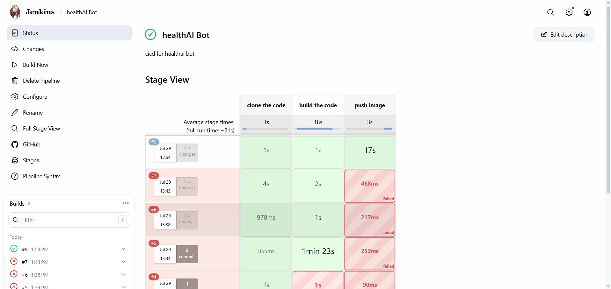

# HealthAI Bot 🩺🤖

An AI-powered healthcare assistant that answers real-time medical queries and provides conversational support to users, built with OpenAI's models and a Streamlit frontend.

🔗 **Live App:** [healthai-bot-abhishekakurhade.streamlit.app](https://healthai-bot-abhishekakurhade.streamlit.app/)

---

## 📌 Overview

HealthAI Bot is a conversational chatbot designed to make basic healthcare information more accessible. It integrates OpenAI's language models with a simple, interactive Streamlit UI, allowing users to ask medical questions and receive helpful, real-time responses.

---

## 🛠️ Tech Stack

| Category         | Tools / Technologies        |
|-------------------|------------------------------|
| Language          | Python                      |
| AI / ML           | OpenAI API                  |
| Frontend          | Streamlit                   |
| CI/CD             | Jenkins                     |
| Containerization  | Docker                      |
| Cloud / Infra     | AWS EC2                     |
| Version Control   | Git, GitHub                 |

---

## 🚀 Features

- Real-time conversational responses to healthcare-related queries
- Simple, interactive Streamlit-based chat interface
- Integrated with OpenAI's models for natural language understanding
- Fully automated build and deployment pipeline via Jenkins

---

## ⚙️ CI/CD Pipeline (Jenkins)

The project uses a Jenkins pipeline to automate the build and deployment process. The pipeline runs in **3 stages**:

1. **Clone the Code** – Pulls the latest code from this GitHub repository
2. **Build the Code** – Installs dependencies and builds the Docker image
3. **Push Image** – Pushes the built Docker image to the container registry

**Pipeline stage view:**



---

## ☁️ Infrastructure (AWS EC2)

The Jenkins CI/CD setup runs on a **Master-Agent architecture** hosted on **AWS EC2**:

- **`jenkinserver`** – Jenkins master node, orchestrates the pipeline
- **`jenkin-node`** – Jenkins build agent, executes pipeline jobs

Both instances run on `t3.micro` EC2 instances in the `us-east-1` region.

**EC2 instance dashboard:**


---

## 📂 Project Structure

```
HealthAI-Bot/
├── app.py                # Streamlit application entry point
├── requirements.txt      # Python dependencies
├── Dockerfile            # Container build instructions
├── Jenkinsfile           # CI/CD pipeline definition
└── README.md             # Project documentation
```

---

## ▶️ Getting Started

### Prerequisites
- Python 3.8+
- OpenAI API key
- Docker (optional, for containerized deployment)
- Jenkins (optional, for CI/CD)

### Installation

```bash
# Clone the repository
git clone https://github.com/abhishekakurhade/HealthAI-Bot.git
cd HealthAI-Bot

# Install dependencies
pip install -r requirements.txt

# Set your OpenAI API key
export OPENAI_API_KEY="your-api-key-here"

# Run the app
streamlit run app.py
```

### Run with Docker

```bash
docker build -t healthai-bot .
docker run -p 8501:8501 healthai-bot
```

---

## 🔄 CI/CD Workflow Summary

```
GitHub Push → Jenkins (Clone → Build → Push Image) → Docker Image → Deployment
```

Every code change pushed to the repository triggers the Jenkins pipeline, which builds a fresh Docker image and pushes it to the registry — enabling fast, consistent, and repeatable deployments.

---

## 📈 Outcome

Successfully deployed an AI-driven healthcare chatbot with a fully automated CI/CD pipeline, improving accessibility to basic healthcare information and demonstrating end-to-end DevOps practices (Jenkins + Docker + AWS EC2).

---

## 👤 Author

**Abhishek Akurhade**
AI/ML Developer — integrated OpenAI models with Streamlit and implemented CI/CD automation using Jenkins on AWS EC2.
